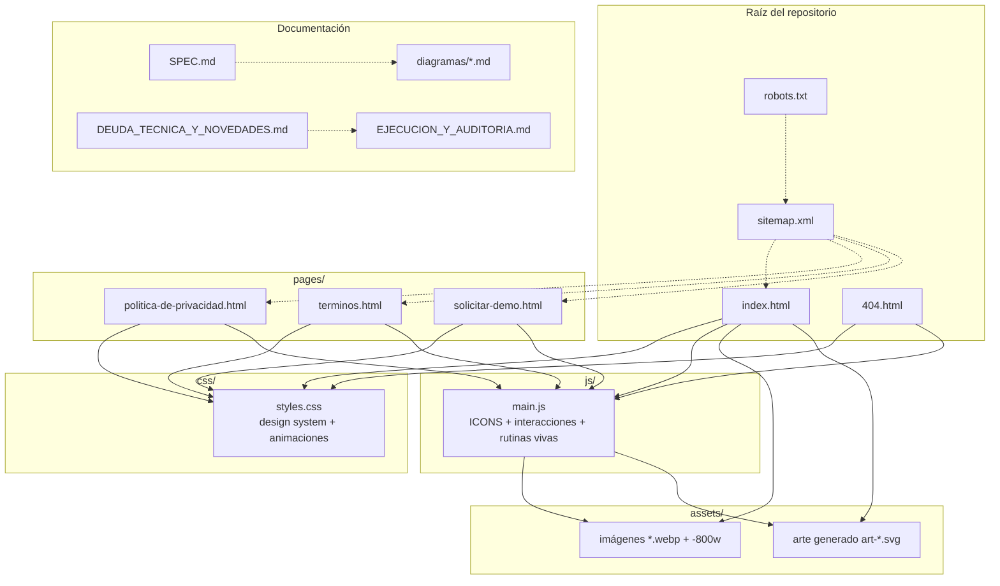
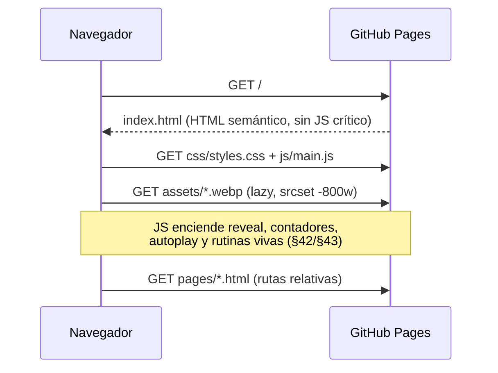

# 01 · Arquitectura de archivos

Diagrama de la estructura y las dependencias entre los archivos del sitio.

## Flujo de un visitante

### Notas
- Multipágina sin build tooling: los `<header>`/`<footer>` se replican a mano
  (DUDE-08). Rutas relativas (decisión 5).
- Íconos: set SVG lineal inline en `main.js` (`ICONS`) renderizado vía
  `data-icon`.
- Despliegue: rama `main` → GitHub Pages
  (`https://agutierrezg1995.github.io/Prisma--App-de-Recaudo/`, GO-LIVE).