# 02 · Secciones y narrativa

La landing narra la historia de valor de Prisma$ (SPEC §7/§9). Cada bloque
responde una pregunta del visitante; el scroll acompaña la narrativa.

```mermaid
flowchart LR
    subgraph A["1 · Barra superior + Navbar"]
        A1["Topbar cíclico (3 msgs reales)"]
        A2["Nav sticky · scroll-spy · menú mobile"]
    end

    subgraph B["2 · Hero"]
        B1["H1 + rotador de frases de valor"]
        B2["CTAs → demo"]
        B3["Tour autoplay (screenshot + arte SVG)"]
        B4["dots de actividad + scroll cue"]
    end

    subgraph C["3 · Slider de producto"]
        C1["4 slides · autoplay 5.6 s · dots/flechas/swipe"]
    end

    subgraph D["4 · El problema"]
        D1["3 cards · información dispersa / poca visibilidad / seguimiento manual"]
    end

    subgraph E["5 · Solución"]
        E1["device dashboard + 5 chips de capacidades (detail)"]
    end

    subgraph F["6 · Cómo funciona"]
        F1["Línea de 5 pasos con progreso por scroll"]
    end

    subgraph G["7 · Monitoreo en tiempo real"]
        G1["Feed de notificaciones EN VIVO (H-01)"]
        G2["mini-gráfico con punto viajero (H-02)"]
    end

    subgraph H["8 · Ingresos y egresos"]
        H1["Cuadre general + barrido de luz (H-03)"]
    end

    subgraph I["9 · Dashboard / Reportes"]
        I1["Stats que respiran (H-07) · tabs · gráficos"]
    end

    subgraph J["10 · Beneficios"]
        J1["6 cards con arte SVG generado + thumb real"]
    end

    subgraph K["11 · Seguridad"]
        K1["Escudo + satélite orbital (H-05)"]
    end

    subgraph L["12 · Product Experience"]
        L1["carousel showcase con flechas/teclado"]
    end

    subgraph M["13 · CTA principal"]
        M1["conversión + respiro ambiental (H-04) + prisma-partículas"]
    end

    subgraph N["14 · Footer"]
        N1["contacto WhatsApp/correo · legales · deriva de gradiente (H-09)"]
    end

    A --> B --> C --> D --> E --> F --> G --> H --> I --> J --> K --> L --> M --> N
```

## Mensaje narrativo (preguntas que responde)

| Pregunta del visitante | Sección |
| --- | --- |
| ¿Qué es y qué promete? | Hero + Slider |
| ¿Qué problema resuelve? | El problema |
| ¿Cómo funciona la plataforma? | Solución + Cómo funciona |
| ¿Me sirve para mi recaudo? | Monitoreo + Ingresos/Egresos + Dashboard |
| ¿Por qué confiar? | Seguridad + Beneficios + Showcase |
| ¿Y ahora qué? | CTA principal + Footer (contacto) |

## Badge "En vivo" (O-01)
Monitoreo (G) y Dashboard (I) lucen `eyebrow--live` con punto verde que late:
son las secciones con datos vivos (§43 O-01).