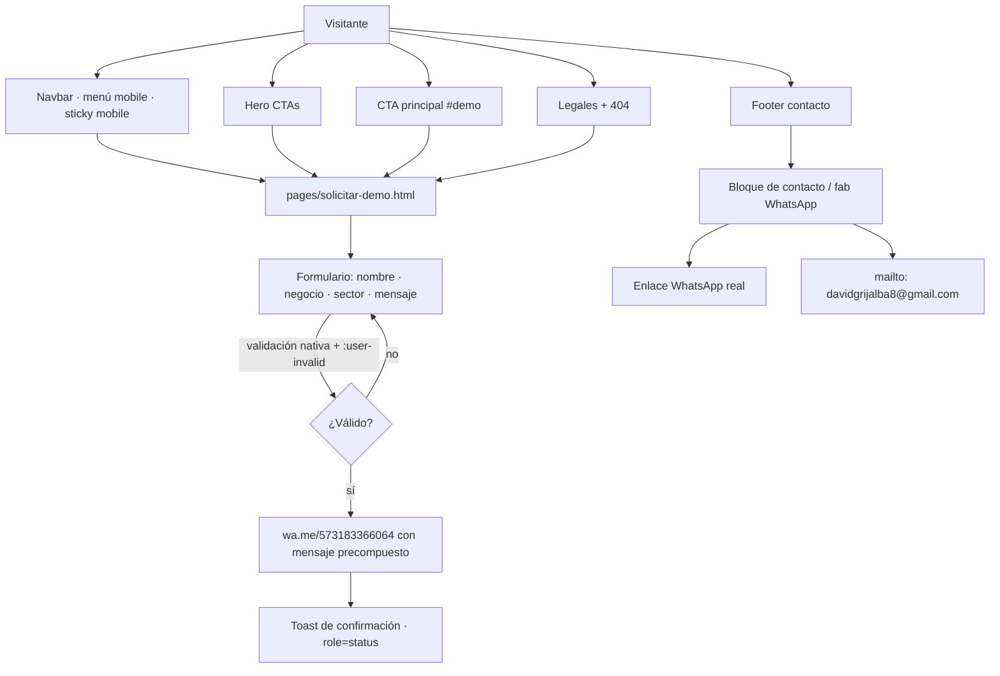

# 03 · Flujo de conversión (visitante → demo/WhatsApp)

Todos los CTA primarios llevan a `pages/solicitar-demo.html` (DUDE-13/19);
el formulario compone un mensaje y abre WhatsApp con número real
(`573183366064`, §39.1/§39.8).

## Notas
- Sin backend: el envío es composición de WhatsApp en el dispositivo
  (decisión 7, DUDE-11). Los datos de contacto reales están en
  `datos de contacto.md` y `CONTACT` en `main.js`.
- Redes sociales: bloque `data-social` presente pero vacío hasta recibir
  handles reales (DUDE-18/§35, nunca URLs inventadas).
- Decisión 6 (DUDE-06): patrón de CTA **corto** "Solicitar demo" (nav,
  sticky, indicadores) y **largo** "Solicitar una demo" (hero/CTA).