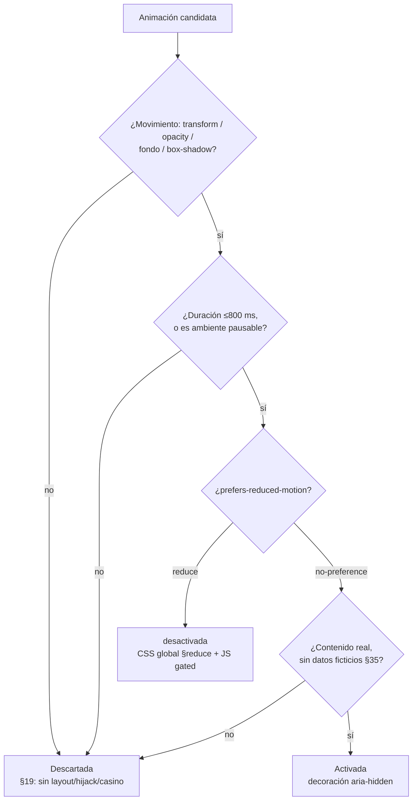
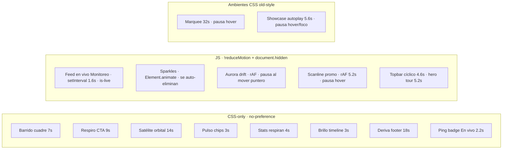
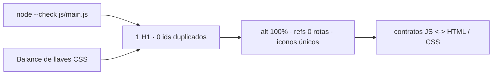

# 04 · Sistema de animación y guardas

La página combina motion de entrada (scroll reveals), movimiento pausable y
**rutinas vivas constantes** (§42 G-01…G-10, §43 H-01…H-09). Todo pasa por
una puerta de guardas (SPEC §19/§23/§35).

## Puerta de guardas (toda animación)

## Rutinas vivas constantes (§42/§43)

## Verificación que se corre en cada pasada

### Guardas y restricciones
- Todas las rutinas JS se apagan con `prefers-reduced-motion` y con pestaña
  oculta (`document.hidden`).
- Solo `transform`/`opacity`/filtros (más `background`/`box-shadow` en §43)
  → sin reflow, GPU-friendly.
- Los SVG generados (`art-*.svg`) animan internamente solo con
  `no-preference` gracias al CSS global §reduce.
- Marcos de duración: interactivos ≤800 ms; ambientes pausables hasta 32 s.