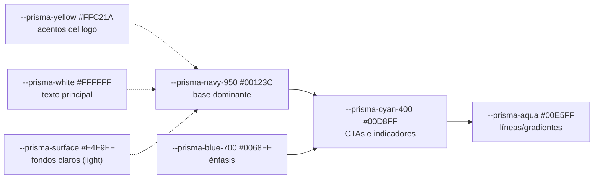
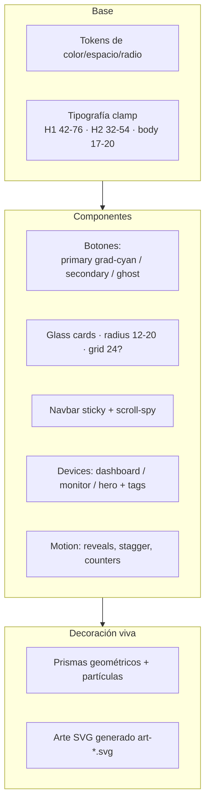

# 05 · Sistema de diseño y tokens

Paleta, tipografía y patrones visuales (SPEC §1/§26/§31). Definidos como
variables CSS en `css/styles.css`.

## Paleta principal (tokens CSS)

## Patrones componentes (cómo se construye la UI)

## Vocabulario de marca (grant)

- **Logo oficial**: siempre como asset, sin redibujar/recolorear/deformar.
- **Lenguaje**: "Centraliza · Monitorea · Decide" (badge hero).
- **Badges de estado**: `eyebrow--live` "· En vivo" (O-01) en secciones con
  datos vivos.
- **Identidad**: glassmorphism moderado, gradientes luminosos, líneas de
  conexión; navy + cian + acentos dorados.

### Notas de componentes clave
- `device--dashboard`: barra de ventana + pips (patrón "panel de control").
- `device--monitor`: bezel/muesca de app móvil (patrón "app tiempo real").
- `device--hero`: líneas ledger + fade (patrón "cuadre general").
- Cada device lleva un `device__tag` con su rol (tratamiento único, DUDE-17).